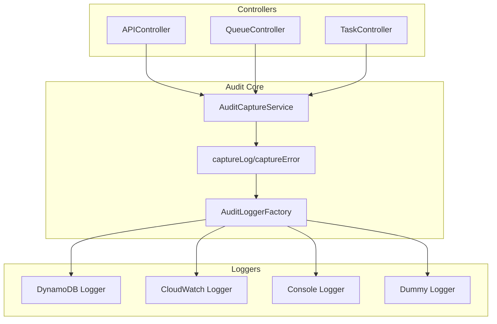
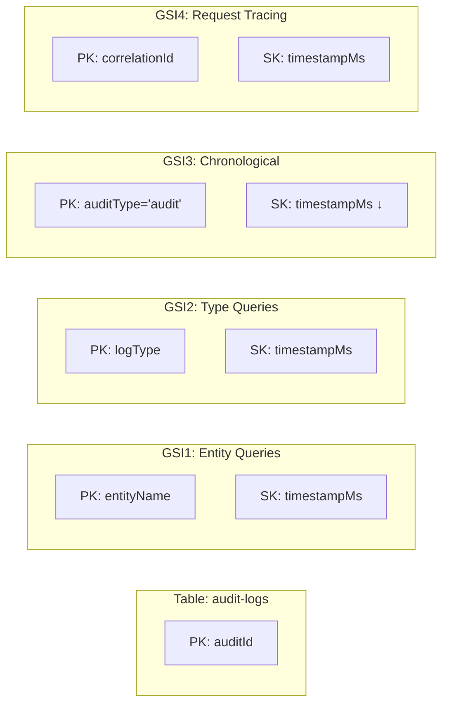

# FW24 Audit System

A serverless audit logging system for FW24 framework applications. Provides automatic audit trail capture for API controllers, queue processors, and scheduled tasks.

## 🎯 Design Principles

- **Non-blocking**: Audit failures don't break business logic
- **Configurable**: Enable/disable per controller with fine-grained control  
- **Sampling**: Reduce overhead in high-traffic scenarios
- **Correlation**: Track requests across service boundaries
- **Performance**: Minimal impact on Lambda execution
****
## 🏗️ Architecture



## 📊 Data Model

```typescript
interface AuditEntry {
  // Core fields
  auditId?: string;                    // Auto-generated UUID
  timestamp?: string;                  // ISO timestamp
  timestampMs?: number;               // Unix timestamp for sorting
  
  // Classification
  logType?: 'audit' | 'log' | 'event' | 'metric';
  subType?: string;                   // api_request, payment_processed, etc.
  severity?: 'info' | 'warn' | 'error' | 'critical';
  category?: string;                  // business, security, performance
  
  // Entity tracking
  entityName?: string;                // user, payment, order
  entityId?: string;                  // Specific entity ID
  eventType?: string;                 // create, update, delete, login
  operation?: string;                 // Alias for eventType
  
  // Context & tracking
  correlationId?: string;             // Request chain tracking
  actor?: Actor;                      // Who performed the action
  status?: string;                    // completed, failed, pending
  success?: boolean;                  // Operation success flag
  
  // Flexible data
  data?: any;                         // Main payload
  metadata?: any;                     // Additional context
  context?: any;                      // Request/response context
  metrics?: Record<string, any>;      // Performance/business metrics
}
```

### DynamoDB Indexes



## ⚙️ Configuration

### API Controller
```typescript
@Controller('/users', {
  audit: {
    enabled: true,
    category: 'user_management',
    samplingFn: createHashBasedSampling(0.1),
    includes: {
      request: ['headers', 'body'],
      response: ['headers']
    },
    skipStart: false,
    skipEnd: false,
    skipErrors: false,
    customContext: { team: 'backend' }
  }
})
export class UserController extends APIController { 
  
  @Get('/profile')
  getProfile() {
    // Uses controller-level audit config
    return { profile: 'data' };
  }

  @Post('/login', {
    audit: {
      category: 'authentication',
      includes: {
        request: ['headers', 'body'],
        response: ['headers'] // No response body for security
      },
      dataProtection: {
        deepRedact: {
          blacklistedKeys: ['password', 'token'],
          replacement: '[SECURITY-REDACTED]'
        }
      }
    }
  })
  login() {
    // Method-level config overrides/enhances controller config
    return { token: 'jwt-token' };
  }

  @Get('/sensitive-data', {
    audit: {
      enabled: false // Completely disable audit for this endpoint
    }
  })
  getSensitiveData() {
    // No audit logs will be generated
    return { sensitiveData: 'classified' };
  }
}
```

### Queue Controller
```typescript
@Queue('user-notifications', {
  audit: {
    enabled: true,
    category: 'notifications',
    samplingFn: createHashBasedSampling(0.05)
  }
})
export class NotificationQueueController extends QueueController { }
```

### Task Controller
```typescript
@Task('daily-cleanup', {
  schedule: 'cron(0 2 * * ? *)',
  audit: {
    enabled: true,
    category: 'maintenance',
    skipStart: true
  }
})
export class CleanupTaskController extends TaskController { }
```

### Environment Variables
```bash
AUDIT_ENABLED=true
AUDIT_TYPE=dynamodb
AUDIT_TABLE_NAME=my-app-audit-logs
```

## 🔧 Usage

### Manual Logging
```typescript
import { captureLog, captureError } from '@ten24group/fw24/audit';

// Log business event
await captureLog({
  logType: 'event',
  subType: 'payment_processed',
  entityName: 'payment',
  entityId: 'pay_123',
  operation: 'create',
  status: 'completed',
  metrics: {
    duration: 1200,
    amount: 150000
  }
});

// Log error
await captureError(new Error('Payment failed'), {
  entityName: 'payment',
  entityId: 'pay_123'
});
```

### Automatic Controller Auditing
Controllers automatically capture:
- **Start events**: When processing begins
- **End events**: When processing completes
- **Error events**: When errors occur

```typescript
@Controller('/payments', {
  audit: { enabled: true, category: 'financial' }
})
export class PaymentController extends APIController {
  async createPayment(request: Request): Promise<Response> {
    // Start event automatically captured
    
    const payment = await this.paymentService.create(request.body);
    
    // Optional manual business event
    await captureLog({
      logType: 'event',
      subType: 'payment_created',
      entityName: 'payment',
      entityId: payment.id
    });
    
    return { payment };
    // End event automatically captured
  }
}
```

## 🔒 Data Protection

The audit system includes automatic data redaction to protect sensitive information in logs.

### Default Protection
Automatically redacts common sensitive fields:
```typescript
// These fields are redacted by default:
const sensitiveFields = [
  'password', 'secret', 'privateKey', 'authorization', 'token',
  'accessToken', 'refreshToken', 'apiKey', 'clientSecret',
  'creditCard', 'cardNumber', 'ssn', 'bankAccount', 'routingNumber', 'cvv',
  'cookie', 'email', 'set-cookie'
];
```

### Configuration
```typescript
@Controller('/users', {
  audit: {
    enabled: true,
    dataProtection: {
      enabled: true,  // Default: true
      deepRedact: {
        blacklistedKeys: ['password', 'secret', 'apiKey'], // Custom sensitive fields
        caseSensitiveKeyMatch: false,  // Default: false
        replacement: '[REDACTED]'      // Default: '[REDACTED]'
      }
    }
  }
})
export class UserController extends APIController { }
```

### Custom Protection Function
```typescript
@Controller('/payments', {
  audit: {
    enabled: true,
    dataProtection: {
      customProtectionFn: (auditEntry, config) => {
        // Custom business logic for data protection
        if (auditEntry.data?.paymentMethod) {
          auditEntry.data.paymentMethod = {
            type: auditEntry.data.paymentMethod.type,
            last4: '****'  // Keep only safe fields
          };
        }
        return auditEntry;
      }
    }
  }
})
export class PaymentController extends APIController { }
```

### Protected Audit Example
```typescript
// Before protection:
{
  "data": {
    "user": {
      "email": "user@example.com",
      "password": "mySecretPassword",
      "profile": { "name": "John Doe" }
    },
    "headers": {
      "authorization": "Bearer abc123",
      "cookie": "session=xyz789"
    }
  }
}

// After protection:
{
  "data": {
    "user": {
      "email": "[REDACTED]",
      "password": "[REDACTED]",
      "profile": { "name": "John Doe" }
    },
    "headers": {
      "authorization": "[REDACTED]",
      "cookie": "[REDACTED]"
    }
  }
}
```

### Manual Data Protection
```typescript
import { protectAuditData } from '@ten24group/fw24/audit';

// Protect sensitive data manually
const auditEntry = {
  data: {
    user: {
      email: 'user@example.com',
      password: 'secret123',
      profile: { name: 'John Doe' }
    }
  }
};

const protectedEntry = protectAuditData(auditEntry, {
  enabled: true,
  deepRedact: {
    blacklistedKeys: ['password', 'email', 'creditCard'],
    replacement: '[PROTECTED]'
  }
});

// Result: { data: { user: { email: '[PROTECTED]', password: '[PROTECTED]', profile: { name: 'John Doe' } } } }
```

### Best Practices
- **Always enabled**: Data protection is enabled by default
- **Custom fields**: Add business-specific sensitive fields to `blacklistedKeys`
- **Custom functions**: Use for complex redaction logic beyond simple field matching
- **Test thoroughly**: Verify your protection rules work as expected
- **Manual protection**: Use `protectAuditData()` for non-audit data that needs protection

## 🎯 Method-Level Audit Configuration

Override or enhance controller-level audit settings on individual routes for fine-grained control.

### How Method-Level Config Works

```typescript
@Controller('/api', {
  audit: {
    enabled: true,
    category: 'general-api',
    includes: { request: ['headers'] }
  }
})
export class ApiController extends APIController {
  
  @Get('/public-data')
  getPublicData() {
    // Uses controller config: category='general-api', includes=['headers']
  }
  
  @Post('/secure-action', {
    audit: {
      category: 'security',           // Overrides controller category
      includes: {
        request: ['headers', 'body'], // Enhances controller includes
        response: ['headers']
      },
      dataProtection: {
        deepRedact: {
          blacklistedKeys: ['apiKey', 'secret'] // Adds to controller blacklist
        }
      }
    }
  })
  secureAction() {
    // Final config: category='security', includes merged, blacklist combined
  }
  
  @Get('/internal', {
    audit: { enabled: false }        // Completely disables audit for this route
  })
  internalEndpoint() {
    // No audit logs generated
  }
}
```

### Configuration Merging Rules

1. **Method config takes precedence** over controller config
2. **Arrays are merged and deduplicated** (e.g., `blacklistedKeys`, `includes.request`)
3. **Objects are deep merged** with method values overriding controller values
4. **Disabled audit** (`enabled: false`) stops all logging for that route

### Common Use Cases

**High-Security Endpoints:**
```typescript
@Post('/auth/login', {
  audit: {
    category: 'authentication',
    samplingFn: createAlwaysSample(), // Never sample auth events
    dataProtection: {
      deepRedact: {
        blacklistedKeys: ['password', 'mfa', 'recoveryCode'],
        replacement: '[AUTH-REDACTED]'
      }
    }
  }
})
```

**Performance-Critical Endpoints:**
```typescript
@Get('/health', {
  audit: {
    enabled: false // No audit overhead for health checks
  }
})
```

**Debug/Development Endpoints:**
```typescript
@Post('/debug/test', {
  audit: {
    category: 'debug',
    includes: {
      request: ['headers', 'body', 'query'],
      response: ['headers', 'body'] // Include everything for debugging
    },
    customContext: {
      environment: 'development',
      debug: true
    }
  }
})
```

## 🎛️ Sampling

```typescript
// Hash-based (deterministic)
samplingFn: createHashBasedSampling(0.1)  // 10%

// Random sampling  
samplingFn: createRandomSampling(0.05)    // 5%

// Custom logic
samplingFn: (correlationId: string, operation: string) => {
  return operation.includes('error') || Math.random() < 0.01;
}

// Always/never
samplingFn: createAlwaysSample()   // Debug mode
samplingFn: createNeverSample()    // Disable
```

## 🔍 Querying

### Using Audit Service
```typescript
import { DynamoDBAuditEntityService } from '@ten24group/fw24/audit';

const auditService = new DynamoDBAuditEntityService();

// Latest audits (uses GSI3, descending by timestampMs)
const latestAudits = await auditService.list();

// Find by entity (uses GSI1)
const userAudits = await auditService.query('gsi1')
  .where(({ entityName }, { eq }) => eq(entityName, 'user'))
  .go();

// Find by correlation ID (uses GSI4)  
const requestTrace = await auditService.query('gsi4')
  .where(({ correlationId }, { eq }) => eq(correlationId, 'req-123'))
  .go();

// Find by log type (uses GSI2)
const events = await auditService.query('gsi2')
  .where(({ logType }, { eq }) => eq(logType, 'event'))
  .go();
```

## 📋 API Reference

### Core Functions
- `captureLog(options)`: Manual audit logging
- `captureError(error, options)`: Error logging with context
- `AuditCaptureService.captureStart()`: Operation start (automatic)
- `AuditCaptureService.captureEnd()`: Operation end (automatic)

### Data Protection Functions
- `protectAuditData(auditEntry, config)`: Apply data protection to audit entries
- `DataProtectionConfig`: Configuration interface for data redaction
- `DeepRedactConfig`: Deep redact library configuration options

### Sampling Functions
- `createHashBasedSampling(rate)`: Deterministic sampling
- `createRandomSampling(rate)`: Random sampling
- `createAlwaysSample()`: Always log (debug)
- `createNeverSample()`: Never log (disable)

### Interfaces
```typescript
interface DataProtectionConfig {
  enabled?: boolean;
  deepRedact?: DeepRedactConfig;
  customProtectionFn?: (auditEntry: AuditEntry, config: DataProtectionConfig) => AuditEntry;
}

interface DeepRedactConfig {
  blacklistedKeys?: string[];
  caseSensitiveKeyMatch?: boolean;
  remove?: boolean;
  replacement?: string;
}
```
