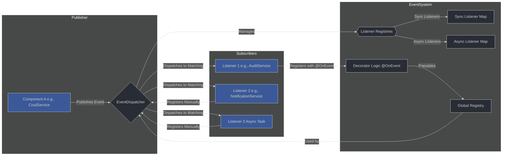

# Event System Documentation

This document provides a comprehensive overview of the event system used within the `fw24` framework. It details its architecture, how to use it, and its integration with various components like `crud-service`, `api-gateway-controller`, `sqs-controller`, and `task-controller`.

## 1. Introduction

The event system provides a decoupled way for different parts of the application to communicate and react to significant occurrences. It allows for extensibility and cleaner separation of concerns by enabling components to publish events without needing to know who or how many subscribers are listening. Similarly, subscribers can react to events without being tightly coupled to the event publishers.

This system supports:

- **Synchronous and Asynchronous Event Handling:** Listeners can execute immediately (blocking further execution until complete) or asynchronously (fire-and-forget).
- **Flexible Event Matching:** Events can be matched by simple strings or by complex, structured objects with wildcard capabilities.
- **Decorator-based and Manual Listener Registration:** Listeners can be easily registered using the `@OnEvent` decorator or programmatically.
- **Typed Event Payloads:** Generic types help in providing type safety for event data.

## 2. Core Concepts

### 2.1. Event (`IEventPayload`)

An event represents a significant occurrence in the system. It's an object that conforms to the `IEventPayload<TData>` interface:

```typescript
export interface IEventPayload<TData = any> {
  type: EventMatcher; // Defines what kind of event this is
  data?: TData;        // The actual data associated with the event
  timestamp: Date;    // When the event occurred
  entityName?: string; // Optional: If related to a specific data entity
  correlationId?: string; // Optional: For tracing
  context?: Record<string, any>;   // Optional: User, tenant, request info, etc.
}
```

- **`type` (`EventMatcher`):** The most crucial part. It determines which listeners will be invoked. It can be a simple string or a `StructuredEventMatcher`.
- **`data`:** The payload of the event, specific to the event type.
- **`context`:** Additional information, often about the originator of the event (e.g., user, tenant).

### 2.2. Event Matcher (`EventMatcher`)

An `EventMatcher` defines the criteria for an event.

- **String Matcher:** A simple string, e.g., `'user:created'`, `'system:startup'`. Used for unique, global events.
- **Structured Event Matcher (`StructuredEventMatcher`):** An object allowing for multi-dimensional matching and wildcards.

    ```typescript
    export type StructuredEventMatcher = {
      phase?: 'pre' | 'post' | string;
      operation?: 'create' | 'update' | 'delete' | string;
      entity?: string;
      subPhase?: 'validate' | 'duplicate' | string;
      successFail?: 'success' | 'fail' | string;
      customType?: string;
      [key: string]: string | undefined;
    };
    ```

  - An empty object `{}` acts as a wildcard for *all* structured events.
  - A partially filled object matches events where all specified properties in the matcher have the same values in the event's `type`. Other properties in the event's `type` are ignored for matching purposes if not present in the matcher.

### 2.3. Event Handler (`EventHandler`)

An `EventHandler` is a function that gets executed when a matching event is dispatched.

```typescript
export type EventHandler = (payload: IEventPayload<any>) => void | Promise<void>;
```

Handlers can be synchronous (return `void`) or asynchronous (return `Promise<void>`).

### 2.4. Event Dispatcher (`IEventDispatcher` / `EventDispatcher`)

The `EventDispatcher` is the central hub of the event system. Its responsibilities include:

- Registering and unregistering event listeners.
- Dispatching events to all matching listeners.
- Managing synchronous and asynchronous listener execution.
- Automatically registering listeners decorated with `@OnEvent`.

A default instance (`defaultEventDispatcher`) is available for convenience.

## 3. How to Use

### 3.1. Defining Events

**Event Payload (`IEventPayload`):**
When an event occurs, you'll create an `IEventPayload` object.

```typescript
// Example: User creation event
import type { IEventPayload, StructuredEventMatcher } from './event-types'; // Adjust path

interface UserData {
  userId: string;
  username: string;
  email: string;
}

// Context is now a generic Record<string, any> as per IEventPayload
// interface UserContext {
// actorId: string; // Who performed the action
// }

const userCreatedEventMatcher: StructuredEventMatcher = {
  entity: 'User',
  operation: 'create',
  phase: 'post',
  successFail: 'success'
};

const userCreatedEvent: IEventPayload<UserData> = {
  type: userCreatedEventMatcher,
  data: {
    userId: 'user-123',
    username: 'john.doe',
    email: 'john.doe@example.com'
  },
  timestamp: new Date(),
  entityName: 'User',
  context: { // Example context
    actorId: 'admin-system',
    requestId: 'req-abc-123'
  }
};
```

### 3.2. Publishing Events

Use an `EventDispatcher` instance (e.g., `defaultEventDispatcher`) to publish (dispatch) events.

```typescript
import { defaultEventDispatcher } from './event'; // Adjust path

// Assuming userCreatedEvent from the example above
async function publishUserCreation(eventData: UserData, contextData: Record<string, any>) {
  const event: IEventPayload<UserData> = {
    type: { /* ... as defined above ... */ },
    data: eventData,
    timestamp: new Date(),
    entityName: 'User',
    context: contextData
  };

  await defaultEventDispatcher.dispatch(event);
  console.log('User creation event dispatched.');
}
```

### 3.3. Subscribing to Events (Listening)

There are two primary ways to subscribe to events:

#### 3.3.1. Using the `@OnEvent` Decorator

This is the recommended way for methods within classes.

```typescript
import { OnEvent } from './event'; // Adjust path
import type { IEventPayload } from './event'; // Adjust path
// Assume UserData is defined as in the previous example
// interface UserData { userId: string; username: string; email: string; }

class AuditService {
  @OnEvent({ entity: 'User', operation: 'create', phase: 'post' })
  handleUserCreated(payload: IEventPayload<UserData>) { // Adjusted to IEventPayload<UserData>
    console.log('AuditService: User created - ', payload.data?.username);
    // Perform auditing logic...
  }

  @OnEvent('system:shutdown', { async: true })
  async handleSystemShutdown(payload: IEventPayload) {
    console.log('AuditService: System shutdown initiated, performing cleanup...');
    await new Promise(resolve => setTimeout(resolve, 1000)); // Simulate async work
    console.log('AuditService: Cleanup complete.');
  }

  // Listener for all "post" phase events, regardless of entity or operation
  @OnEvent({ phase: 'post' })
  logAllPostEvents(payload: IEventPayload) {
    console.log(`Generic Post-Event: Entity=${payload.entityName}, Type=${JSON.stringify(payload.type)}`);
  }

  // Listener for ALL structured events
  @OnEvent({})
  logAllStructuredEvents(payload: IEventPayload) {
    if (typeof payload.type === 'object') {
        console.log(`AUDIT (All Structured): ${JSON.stringify(payload.type)}`);
    }
  }

  // Listener for ALL events (string and structured)
  @OnEvent('*')
  logEverySingleEvent(payload: IEventPayload) {
    console.log(`AUDIT (Global Wildcard *): ${JSON.stringify(payload.type)}`);
  }
}

// Important: For decorator-based listeners to be registered,
// an EventDispatcher instance must be created *after* the class definition,
// and potentially with the service instance if methods need `this` context correctly bound.
// Example:
// const auditServiceInstance = new AuditService();
// const dispatcher = new EventDispatcher(true, auditServiceInstance);
// The `defaultEventDispatcher` is created with `autoRegisterGlobalListeners: true`
// but without a specific instance context by default. This means it will bind
// to the prototype for instance methods, which works for many cases but might
// require passing `listenerInstanceContext` to the EventDispatcher constructor
// if `this` behaves unexpectedly.
```

**Key points for `@OnEvent`:**

- The `EventDispatcher` constructor has an `autoRegisterGlobalListeners` parameter (defaults to `true`).
- When `autoRegisterGlobalListeners` is `true`, an `EventDispatcher` instance will automatically find and register all methods decorated with `@OnEvent`.
- The `listenerInstanceContext` parameter in the `EventDispatcher` constructor is important for ensuring `this` is correctly bound within decorated instance methods. If you're using a central dispatcher, you might need to manually register listeners or ensure the dispatcher is aware of service instances.

#### 3.3.2. Manual Registration

You can also register listeners programmatically.

```typescript
import { defaultEventDispatcher } from './event'; // Adjust path
import type { IEventPayload, StructuredEventMatcher } from './event'; // Adjust path

const specificUserMatcher: StructuredEventMatcher = { entity: 'User', operation: 'update', phase: 'post' };

function onSpecificUserUpdate(payload: IEventPayload) {
  console.log('Manual Listener: User updated - ', payload.data);
}

defaultEventDispatcher.on(specificUserMatcher, onSpecificUserUpdate);

// To unregister:
// defaultEventDispatcher.off(specificUserMatcher, onSpecificUserUpdate);

// Async listener:
async function onSystemBackupAsync(payload: IEventPayload) {
  console.log('Async Manual Listener: System backup starting...');
  // ... async backup logic
}
defaultEventDispatcher.onAsync('system:backup', onSystemBackupAsync);
```

### 3.4. Synchronous vs. Asynchronous Listeners

- **Synchronous (`on` or `@OnEvent` default):**
  - The `dispatch` call will `await` the completion of all synchronous handlers before proceeding.
  - If a synchronous handler throws an error, it's caught by the dispatcher, logged to `logger.error`, and other synchronous handlers for that event still run. The original `dispatch` call itself will not throw due to a synchronous listener error.
- **Asynchronous (`onAsync` or `@OnEvent(..., { async: true })`):**
  - The `dispatch` call invokes these handlers but does *not* wait for them to complete (fire-and-forget).
  - Execution of the code after `dispatch` continues immediately.
  - Errors occurring during the *invocation* of async handlers (e.g., if the handler itself is not a function, or returns a non-Promise when it shouldn't) or if an async handler returns a non-Promise (which is warned about), are logged using the dispatcher's internal logger (`this.logger.error` or `this.logger.warn`). Errors *within* the Promise execution of an async handler are caught and logged by `this.logger.error` when `awaitAsyncHandlers()` is called.
  - **`awaitAsyncHandlers()`:** If you need to ensure all dispatched asynchronous tasks are completed (e.g., before a Lambda function exits), you can call `await defaultEventDispatcher.awaitAsyncHandlers()`.

### 3.5. Event Matching Logic Details

The dispatcher uses a specific logic to match events to listeners:

1. **Universal String Wildcard (`*`)**: Listeners registered with `'*'` receive *all* events (both string and structured).
2. **For String Events (e.g., `eventPayload.type = 'my:event'`):**
    - Matches listeners registered with the exact string (e.g., `dispatcher.on('my:event', ...)`).
3. **For Structured Events (e.g., `eventPayload.type = { entity: 'User', phase: 'post' }`):**
    - **Exact Match:** Matches listeners registered with an identical `StructuredEventMatcher` (e.g., `dispatcher.on({ entity: 'User', phase: 'post' }, ...)`).
    - **Subset Wildcard Matches:** Iterates through all possible subsets of the dispatched event's `type` properties. For an event `{ entity: 'User', phase: 'post', operation: 'create' }`, it would also match listeners registered for:
        - `{ entity: 'User', phase: 'post' }`
        - `{ entity: 'User', operation: 'create' }`
        - `{ phase: 'post', operation: 'create' }`
        - `{ entity: 'User' }`
        - `{ phase: 'post' }`
        - `{ operation: 'create' }`
    - **Structured Wildcard (`{}`):** Matches listeners registered with an empty object `{}`. These listeners receive *all structured events* but not string events.

**Order of Execution:** The system collects all matching handlers (sync and async separately) and then executes them. There's no guaranteed order of execution *among* listeners for the same event, beyond sync handlers generally completing before async handlers associated with the `dispatch` call are fully awaited by `awaitAsyncHandlers`.

## 4. Architecture & Internals



### Key Files

- **`event-types.ts`:** Defines core interfaces like `IEventPayload`, `EventMatcher`, `StructuredEventMatcher`, `EventHandler`, and `IEventDispatcher`.
- **`event-utils.ts`:** Contains utility functions, notably `getMatcherKey` for canonicalizing `EventMatcher` objects into string keys for internal map storage.
- **`decorator.ts`:** Implements the `@OnEvent` decorator and manages a global registry (`globalListenerRegistry`) of decorated methods. `getGlobalListenerMetadata` exposes this registry.
- **`dispatcher.ts`:** Contains the `EventDispatcher` class.
  - Its constructor can auto-register global listeners from `decorator.ts`.
  - `on()`, `onAsync()`, `off()`: Manage listener registration in internal `syncListeners` and `asyncListeners` maps.
  - `dispatch()`:
        1. Identifies all matching handlers (sync and async) based on the event's `type` and the matching logic described above.
        2. Executes all collected synchronous handlers sequentially, catching and logging individual errors to `logger.error`.
        3. Initiates all collected asynchronous handlers. Promises from these handlers are stored in an internal map (`this.asyncHandlersPromises`, a `Map<string, Set<Promise<void>>>` keyed by the event matcher's string key). Errors during invocation or if a handler returns a non-Promise are logged using an internal logger (`this.logger`).
  - `awaitAsyncHandlers()`: Awaits all stored promises from `this.asyncHandlersPromises`. Any errors caught from these promises during the await are logged using an internal logger (`this.logger.error`). Clears the promise map after awaiting.

## 5. Integration in the Framework

The event system is primarily used to decouple actions from their side effects or subsequent processing steps. The `defaultEventDispatcher` is used by several core components.

### 5.1. `crud-service.ts`

The generic CRUD functions (`getEntity`, `createEntity`, `updateEntity`, `deleteEntity`, `listEntity`, `queryEntity`, `upsertEntity`, `getBatchEntity`) utilize a helper `createEntityEventDispatcher`. This specialized dispatcher simplifies emitting events related to entity operations.

- **Events Emitted:**
  - **Pre-operation (`phase: 'pre'`):** Fired before the main database action.
    - Includes sub-phases like `validate` (`subPhase: 'validate'`) before and after validation logic.
    - For `updateEntity`, includes `compositeKey` sub-phase (`subPhase: 'compositeKey'`) before and after composite key preparation.
  - **Post-operation (`phase: 'post'`):** Fired after the main database action.
    - Includes sub-phases like `validate` (with `successFail: 'success' | 'fail'`).
    - For `updateEntity`, includes `compositeKey` sub-phase.
- **Event `type` Structure:** Typically `StructuredEventMatcher` like:

    ```typescript
    {
      entity: string, // e.g., 'User'
      operation: 'create' | 'update' | 'delete' | 'get' | 'list' | 'query' | 'upsert',
      phase: 'pre' | 'post',
      subPhase?: 'validate' | 'compositeKey', // etc.
      successFail?: 'success' | 'fail' // for post-validation/operation
    }
    ```

- **`data` Payload:** Varies based on the operation and phase, often including input data, identifiers, validation results, or the resulting entity/entities.
- **`context` Payload:** Includes `actor` and `tenant` if provided to the CRUD function.

**Example Listener for `crud-service` events:**

```typescript
import { OnEvent, IEventPayload } from '...'; // adjust paths

class UserActivityLogger {
  @OnEvent({ entity: 'User', operation: 'update', phase: 'post', successFail: 'success' })
  logUserUpdateSuccess(payload: IEventPayload) {
    console.log(`User ${payload.data?.identifiers?.id} updated successfully by actor: ${payload.context?.actorId}`);
  }

  @OnEvent({ entity: 'Product', operation: 'create', phase: 'pre', subPhase: 'validate' })
  beforeProductValidation(payload: IEventPayload) {
    console.log('About to validate new product data:', payload.data?.data);
  }
}
```

### 5.2. `api-gateway-controller.ts` (`APIController`)

The `APIController` base class ensures that all asynchronous event handlers are awaited before the Lambda function successfully exits.

- **Integration Point:** In the `LambdaHandler` method, within the `finally` block:

    ```typescript
    finally {
      // ensure all async event handlers are awaited
      await defaultEventDispatcher.awaitAsyncHandlers();
    }
    ```

- **Purpose:** If an API route handler dispatches an asynchronous event (e.g., for background processing, notifications), this ensures that these tasks are given a chance to complete before the Lambda terminates, preventing premature termination of background work.
- **Usage Scenario:** An API endpoint might handle a request, dispatch an async event to send a confirmation email, and then return a response to the client. `awaitAsyncHandlers()` ensures the email sending logic (if it's an async listener) completes.

### 5.3. `sqs-controller.ts` (`QueueController`)

Similar to `APIController`, the `QueueController` base class ensures that asynchronous event handlers are completed.

- **Integration Point:** In the `LambdaHandler` method, within the `finally` block:

    ```typescript
    finally {
      // ensure all async event handlers are awaited
      await defaultEventDispatcher.awaitAsyncHandlers();
    }
    ```

- **Purpose:** If processing an SQS message triggers further asynchronous events, this ensures their completion before the SQS message processing is considered finished. This is crucial for tasks that might be part of a larger distributed workflow initiated by an SQS event.

### 5.4. `task-controller.ts` (`TaskController`)

The `TaskController` for scheduled tasks also integrates the `awaitAsyncHandlers` call.

- **Integration Point:** In the `LambdaHandler` method, within the `finally` block:

    ```typescript
    finally {
      // ensure all async event handlers are awaited
      await defaultEventDispatcher.awaitAsyncHandlers();
    }
    ```

- **Purpose:** If a scheduled task dispatches asynchronous events (e.g., to update multiple systems, perform cleanup), this makes sure these async operations finish before the scheduled task lambda concludes.

## 6. Advanced Usage & Best Practices

- **Specificity vs. Generality:** Use specific event matchers for targeted actions. Use broader matchers (like only `phase` or `entity`) for cross-cutting concerns (e.g., logging, auditing).
- **Async for I/O:** Prefer asynchronous listeners (`onAsync` or `{ async: true }`) for I/O-bound operations (network calls, file system access) to avoid blocking the main execution flow.
- **Error Handling in Listeners:** While the dispatcher catches errors, robust listeners should implement their own internal error handling if specific recovery or logging is needed.
- **`awaitAsyncHandlers()` Scope:** Be mindful of where `awaitAsyncHandlers()` is called. In Lambda environments, it's typically at the end of the main handler. In long-running applications, you might have different scopes for awaiting.
- **Testing:**
  - Use `clearGlobalListenerRegistry()` in `beforeEach` or `afterEach` in your test files if you are testing decorator-based listener registration to avoid test-to-test interference.
  - Mock the `defaultEventDispatcher` or specific handlers to verify that events are dispatched correctly and handlers are called as expected.
- **Avoid Complex Logic in Dispatchers:** The dispatcher should remain focused on event routing. Complex business logic belongs in the handlers.
- **Event Immutability (Convention):** While not enforced by the system, treat event payloads as immutable once dispatched to avoid unintended side effects between listeners. If a listener needs to modify data, it should typically dispatch a new event.

## 7. Future Considerations / Potential Enhancements

- **Prioritized Listeners:** Introduce a priority system for listeners of the same event.
- **Eventual Consistency Sagas:** More explicit support for sagas or multi-step workflows driven by events.
- **Middleware/Interceptors:** Ability to intercept event dispatching or handling for global modifications or checks.
- **Dead Letter Queue for Events:** A mechanism for handling events that consistently fail in all their async listeners.
- **More Granular `awaitAsyncHandlers`:** Ability to await handlers for a specific event type or correlation ID.

This event system provides a flexible and powerful mechanism for building modular and maintainable applications. By understanding its core concepts and integration points, developers can effectively leverage it to decouple components and manage complex interactions.
