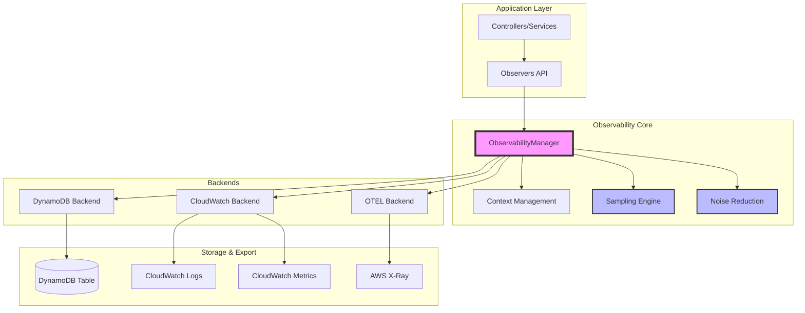
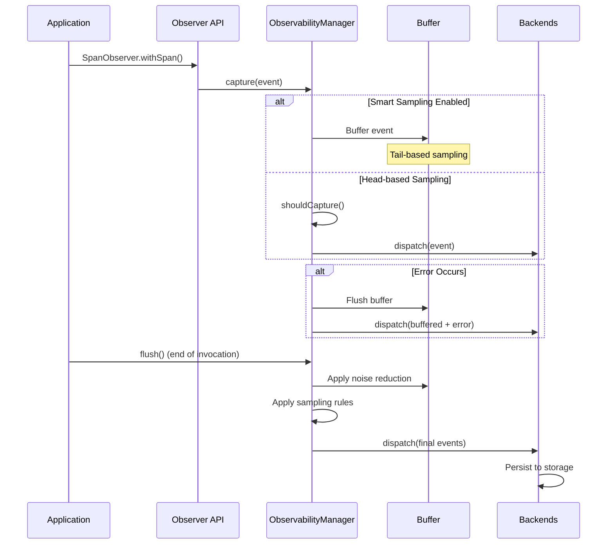
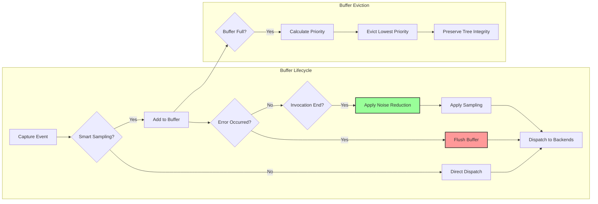
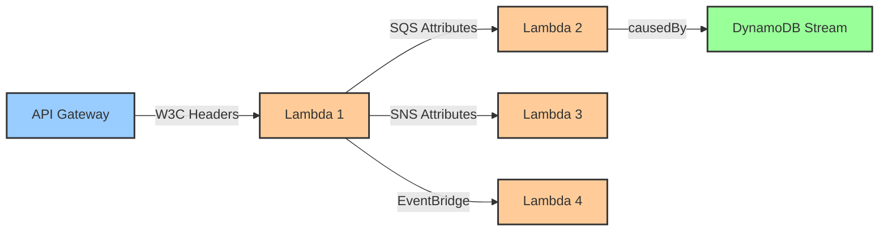
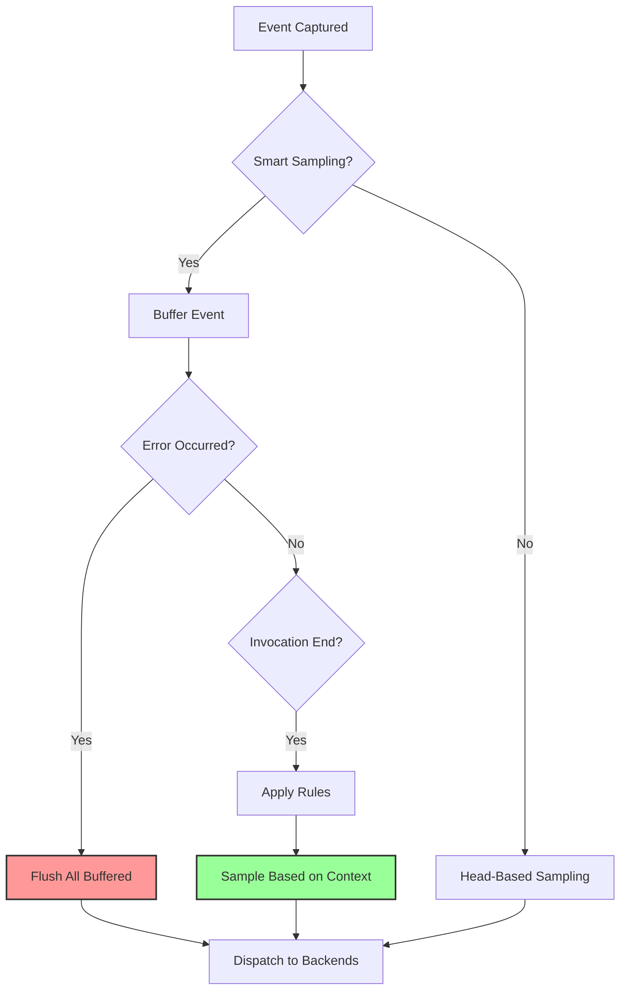
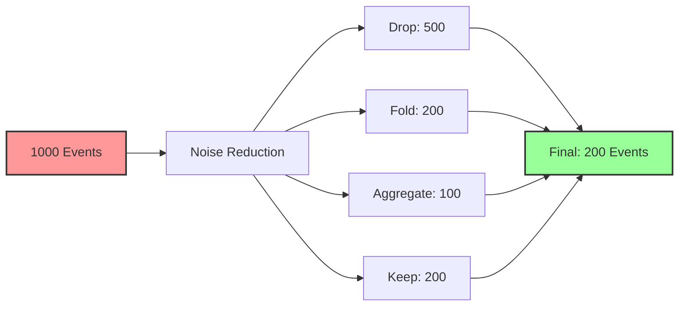
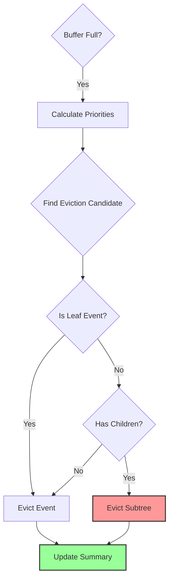
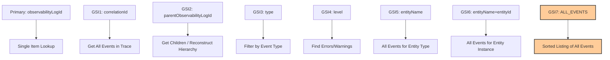
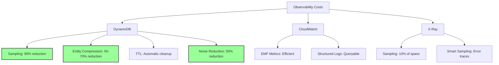

# FW24 Observability System

Unified observability for distributed tracing, logging, metrics, and auditing in serverless AWS Lambda environments.

---

## Table of Contents

- [Quick Start](#quick-start)
- [Architecture Overview](#architecture-overview)
- [Core Concepts](#core-concepts)
- [Observers](#observers)
- [Building Specialized Observers](#building-specialized-observers)
- [Decorators](#decorators)
- [Configuration](#configuration)
- [Advanced Features](#advanced-features)
- [Backend Details](#backend-details)
- [Data Protection](#data-protection)
- [Best Practices](#best-practices)
- [Testing](#testing)
- [Production Checklist](#production-checklist)
- [Performance & Cost Optimization](#performance--cost-optimization)
- [Troubleshooting](#troubleshooting)
- [API Reference](#api-reference)
- [Examples](#examples)
- [Performance](#performance)
- [References](#references)

---

## Quick Start

### 1. Setup (CDK)

```typescript
// index.ts
const app = new Application({
  observability: {
    table: { name: 'observability' },
    ttlDays: 90,
  },
});
```

### 2. Configure (DI Layer)

```typescript
// di.ts
import { DIContainer } from '@ten24group/fw24';
import { createObservabilityConfig } from '@ten24group/fw24/observability';

DIContainer.ROOT.registerConfigProvider({
  provide: 'observability',
  useConfig: createObservabilityConfig({
    serviceName: 'my-app',
    backends: [
      { type: 'dynamodb', enabled: true },
      { type: 'cloudwatch', enabled: true }
    ],
    dataProtection: { enabled: true },
  }),
  priority: 10  // Override framework defaults
});
```

### 3. Use in Code

```typescript
import { AuditObserver, MetricObserver, withSpan } from '@ten24group/fw24/observability';

// Context is auto-established in controllers
try {
  await withSpan('processOrder', async () => {
    await processOrder(orderId);
    AuditObserver.entityCreate('Order', orderId, data);
    MetricObserver.increment('orders.created');
  });
} catch (error) {
  throw error;
}
```

---

## Architecture Overview

### System Architecture



### Event Flow



### Buffer Management



---

## Core Concepts

### Context Management

Observability requires a correlation ID for distributed tracing. Context is automatically established in:
- API Gateway controllers
- SQS handlers
- Task handlers
- DynamoDB stream processors

**Manual context:**
```typescript
import { runWithExecutionContext, createExecutionContext } from '@ten24group/fw24/observability';

await runWithExecutionContext(
  createExecutionContext({ correlationId: requestId, actor }),
  async () => {
    // All observability calls here inherit context
    await withSpan('operation', async () => {
      // ...
    });
  }
);
```

### Trace Propagation



Automatically propagates trace context across:
- HTTP requests (W3C Trace Context)
- SQS messages
- SNS messages
- EventBridge events
- Step Functions
- DynamoDB Streams

**Outgoing HTTP:**
```typescript
import { createHttpHeaders, getCurrentExecutionContext } from '@ten24group/fw24/observability';

const ctx = getCurrentExecutionContext();
const response = await fetch(url, {
  headers: {
    ...createHttpHeaders(ctx),
    'Content-Type': 'application/json',
  },
});
```

---

## Observers

### SpanObserver - Distributed Tracing

**Clean API with Clear Data Separation:**
- `tags` - string key-value pairs for filtering/indexing
- `metrics` - numeric values for dashboards/aggregation
- `data` - arbitrary debug payload (NOT indexed)
- `checkpoints` - timeline markers

```typescript
// Recommended: withSpan for automatic span management
await withSpan('processOrder', async (span) => {
  // Tags - for filtering/searching (indexed)
  span.tag('orderId', order.id);
  span.tags({ region: 'us-east-1', tier: 'premium' });
  
  // Metrics - for dashboards/alerts (numeric)
  span.metric('itemCount', items.length);
  span.metrics({ retries: 0, cacheHits: 5 });
  
  // Data - debug payload (NOT indexed, for inspection only)
  span.setData({ request: body, response: result });
  
  // Checkpoints - timeline markers (can include tags/metrics/data/error)
  span.checkpoint('validation_complete');
  span.checkpoint('payment_processed', {
    tags: { paymentMethod: 'card' },
    metrics: { amount: 149.99 },
    data: { transactionId: 'txn-123' },
  });
  
  // Checkpoint with error
  span.checkpoint('external_call_failed', { error: new Error('API timeout') });
  
  // Errors
  span.recordException(error);
});

// Concise checkpoint pattern (recommended for single-point logging)
SpanObserver.getCurrentSpan()?.checkpoint?.('database.full_scan', {
  tags: { 'db.operation': 'list', 'db.warning': 'no_index' },
  metrics: { 'db.full_scan': 1 },
  data: { filters: queryFilters },
});

// Nested spans - automatically linked to parent
await withSpan('validateOrder', async (span) => {
  span.checkpoint('items_checked', { metrics: { itemCount: 5 } });
});

// Initial values in span options
await withSpan('processPayment', async (span) => {
  span.checkpoint('payment_complete');
}, {
  tags: { paymentMethod: 'card' },
  metrics: { amount: 99.99 },
  data: { orderId: '123' },
});
```

### AuditObserver - Entity Auditing

```typescript
// Entity lifecycle
AuditObserver.entityCreate('User', userId, userData);
AuditObserver.entityUpdate('User', userId, { before, after, diff });
AuditObserver.entityDelete('User', userId, deletedData);

// Custom audit
AuditObserver.record({
  operation: 'permission.granted',
  entityName: 'User',
  entityId: userId,
  data: { role: 'admin', grantedBy: adminId },
  level: 'warn',
});

// Compliance audit
AuditObserver.compliance({
  operation: 'pii.access',
  subType: 'pii_access',
  entityName: 'User',
  entityId: userId,
  data: { fields: ['ssn', 'email'], reason: 'customer_support' },
});
```

### MetricObserver - Business Metrics

```typescript
// Counter
MetricObserver.increment('orders.created');
MetricObserver.increment('items.sold', 5);

// Gauge
MetricObserver.gauge('queue.depth', 42);

// Timing
MetricObserver.timing('api.latency', 145);

// Custom with tags
MetricObserver.record('payment.amount', 99.99, {
  tags: { currency: 'USD', method: 'card' },
  unit: 'dollars',
});
```

### LogObserver - Structured Logging

```typescript
// Standard levels
LogObserver.info('Order processed', { orderId, amount });
LogObserver.warn('Rate limit approaching', { current: 95, limit: 100 });
LogObserver.error('Payment failed', { error, orderId });

// All log levels
LogObserver.trace('Detailed trace', { data });
LogObserver.debug('Debug info', { state });
LogObserver.critical('Critical failure', { error });
```

---

## Building Specialized Observers

The framework provides core observers (Span, Audit, Metric, Log). Applications can build
specialized observers on top of these primitives:

```typescript
// Example: WorkflowObserver (application-specific)
class WorkflowObserver {
  static async execute(name: string, options: { entityName: string; entityId: string }, fn: (workflow: any) => Promise<any>) {
    return await withSpan(`workflow.${name}`, async (span) => {
      span.tags({ 'workflow.name': name, ...options });
      
      const workflow = {
        step: async (stepName: string, stepFn: () => Promise<any>) => {
          return await withSpan(`step.${stepName}`, async (stepSpan) => {
            return await stepFn();
          });
        }
      };
      
      return await fn(workflow);
    });
  }
}

// Example: DecisionObserver (application-specific)
class DecisionObserver {
  static record(decision: { name: string; input: any; output: any }) {
    return AuditObserver.record({
      operation: `decision.${decision.name}`,
      subType: 'algorithm_decision',
      data: { input: decision.input, output: decision.output }
    });
  }
}
```

---

## Decorators

### @Traced - Automatic Span Tracing

```typescript
class OrderService {
  @Traced()
  async processOrder(orderId: string): Promise<Order> {
    // Method automatically traced
  }
  
  @Traced({ 
    name: 'custom-operation',
    level: 'debug',
    captureArgs: true,
    captureResult: true 
  })
  async internalProcess(): Promise<void> {
    // Custom span configuration
  }
}
```

### @Audited - Automatic Audit Logging

```typescript
class UserService {
  @Audited({ operation: 'permission.change' })
  async updatePermissions(userId: string, permissions: string[]): Promise<void> {
    // Method automatically audited
  }
  
  @Audited({ 
    operation: 'sensitive.access',
    level: 'warn',
    captureArgs: true 
  })
  async accessSensitiveData(userId: string): Promise<Data> {
    // Audit with arguments captured
  }
}
```

### @Observed - Unified Observability

```typescript
class OrderService {
  @Observed({ 
    trace: true,
    audit: { action: 'order.create' },
    metric: { name: 'orders.created', type: 'counter' }
  })
  async createOrder(order: Order): Promise<Order> {
    // Method is traced, audited, and metered
  }
}
```

### @ObservedClass - Class-Level Configuration

```typescript
@ObservedClass({ 
  traceAll: true,
  sourceType: 'service',
  exclude: ['internalHelper']
})
class OrderService {
  // All methods automatically traced except excluded ones
  async createOrder(order: Order): Promise<Order> { ... }
  async updateOrder(id: string, data: Partial<Order>): Promise<Order> { ... }
  private internalHelper(): void { ... } // Excluded
}
```

---

## Configuration

### Presets

```typescript
import { productionPreset, developmentPreset, debugPreset } from '@ten24group/fw24/observability';

// Production: Minimal noise, cost-optimized
DIContainer.ROOT.registerConfigProvider({
  provide: 'observability',
  useConfig: productionPreset,
  priority: 10
});

// Development: Balanced visibility
DIContainer.ROOT.registerConfigProvider({
  provide: 'observability',
  useConfig: developmentPreset,
  priority: 10
});

// Debug: Maximum visibility
DIContainer.ROOT.registerConfigProvider({
  provide: 'observability',
  useConfig: debugPreset,
  priority: 10
});
```

### Custom Configuration

```typescript
import { createObservabilityConfig, ObservabilityLevel } from '@ten24group/fw24/observability';

DIContainer.ROOT.registerConfigProvider({
  provide: 'observability',
  useConfig: createObservabilityConfig({
    serviceName: 'my-service',
    minLevel: ObservabilityLevel.INFO,
    
    // Backends
    backends: [
      { type: 'dynamodb', enabled: true },
      { type: 'cloudwatch', enabled: true },
      { type: 'otel', enabled: true }
    ],
    
    // Sampling
    sampling: {
      enabled: true,
      smart: true, // Tail-based sampling
      maxBufferSize: 1000,
      rates: {
        trace: 0.01,
        debug: 0.1,
        info: 1.0,
        warn: 1.0,
        error: 1.0,
        critical: 1.0,
      },
      // Rule-based sampling (highest priority)
      rules: [
        { target: 'tenant', pattern: 'premium-*', rate: 1.0 },
        { target: 'route', pattern: '/api/checkout', rate: 1.0 },
        { target: 'tag', pattern: 'priority:high', rate: 1.0 },
      ],
    },
    
    // Type-specific config
    types: {
      span: {
        minLevel: ObservabilityLevel.INFO,
        sampling: { enabled: true, rate: 0.1 },
      },
      audit: {
        minLevel: ObservabilityLevel.INFO,
        sampling: { enabled: false, rate: 1.0 }, // Capture all audits
      },
    },
    
    // Span filtering
    spans: {
      minDurationMs: 100, // Skip fast spans
      skipEmpty: true, // Skip spans with no events/errors
    },
    
    // Data protection
    dataProtection: {
      enabled: true,
      fuzzyKeyMatch: true,
      blacklistedKeys: ['password', 'token', 'secret', 'apiKey'],
    },
    
    // DynamoDB config
    dynamodb: {
      ttlDays: 30,
      // Note: Compression is handled automatically by entity schema
      // See observability-log-entity.ts for compressed fields
    },
    
    // Noise reduction
    noiseReduction: {
      enabled: true,
      presets: ['fw24.hotpaths', 'fw24.batch_processors'],
      emitSummaries: true,
    },
  }),
  priority: 10
});
```

---

## Advanced Features

### Smart Sampling (Tail-Based)



**Benefits:**
- Capture 100% of error traces
- Sample successful traces based on rules
- Reduce costs while maintaining visibility

**Configuration:**
```typescript
sampling: {
  enabled: true,
  smart: true,
  maxBufferSize: 1000,
  minLevelOnError: ObservabilityLevel.INFO, // On error, capture INFO+ events
}
```

### Noise Reduction (Priority-Based)

**Priority-based rule evaluation** ensures predictable behavior when multiple rules match:

```typescript
import { DECISION_BASE_PRIORITY } from '@ten24group/fw24/observability';

// Decision base priorities (higher = harder to override):
// - keep: 100 (always keep, hard to override)
// - aggregate: 50 (summarize into parent)
// - fold: 40 (collapse into parent checkpoint)
// - downgrade: 30 (strip heavy fields)
// - drop: 10 (remove entirely, easy to override)

noiseReduction: {
  enabled: true,
  presets: ['fw24.hotpaths'],
  rules: [
    // HIGH PRIORITY: Always keep admin operations (overrides builtin drop rules)
    {
      id: 'myapp.keep_admin_reads',
      priority: 200,  // Higher than any builtin rule
      match: {
        type: 'span',
        operation: '/^HTTP GET.*\\/admin\\b/'
      },
      decision: 'keep',
      reason: 'Always keep admin operations for audit compliance'
    },
    
    // MEDIUM PRIORITY: Drop internal health checks
    {
      id: 'myapp.drop_health_checks',
      priority: 50,
      match: {
        type: 'span',
        operation: '/healthcheck|ping|ready/'
      },
      except: [
        { success: false }  // Keep failed health checks
      ],
      decision: 'drop',
      reason: 'Drop successful health checks'
    },
    
    // LOW PRIORITY: Aggregate batch operations (easily overridden)
    {
      id: 'myapp.aggregate_batch_items',
      priority: 10,
      match: {
        type: 'span',
        operation: '/process.*item$/i'
      },
      decision: 'aggregate',
      reason: 'Aggregate per-item spans in batch operations'
    }
  ]
}
```

**Rule Evaluation Algorithm:**
1. Per-event override (`event.capture?.noise`) - absolute priority
2. Hard signals (errors/failures) - always kept (priority: 1000)
3. Collect ALL matching rules (custom + builtin)
4. Filter out rules with matching exceptions
5. Sort by effective priority (explicit priority OR decision base priority)
6. Winner = highest priority rule

**Exception Patterns:**
```typescript
{
  id: 'drop_reads',
  match: { operation: '/GET/' },
  except: [
    { success: false },              // Don't drop errors
    { level: ['error', 'critical'] },// Don't drop critical
    { minDurationMs: 1000 }          // Don't drop slow (>1s)
  ],
  decision: 'drop'
}
```

Automatically reduces noise from repetitive operations:



**Strategies:**
- **Drop**: Remove low-value events (e.g., batch processor spans)
- **Fold**: Merge identical events (e.g., repeated cache hits)
- **Aggregate**: Summarize patterns (e.g., 100 items → summary checkpoint)

**Built-in Presets:**
- `fw24.hotpaths`: Reduce noise from hot code paths
- `fw24.batch_processors`: Reduce noise from batch operations

### Buffer Eviction Strategy



**Priority Calculation:**
- `bypass` events: Infinity (never evicted)
- Errors: +30
- Audits: +50
- Log level: +10 per level
- Long duration (>1s): +20

**Tree Integrity:**
- Never evict parent while keeping children
- Evict entire subtrees to prevent orphans
- Prefer evicting non-span events first

### Observability Summary

Track buffer efficiency per invocation:

```typescript
import { ObservabilityManager } from '@ten24group/fw24/observability';

// Get summary at any time
const summary = ObservabilityManager.getSummary();
console.log(summary);
// {
//   captured: 150,   // Events captured immediately
//   buffered: 500,   // Events buffered for tail-based sampling
//   evicted: 50,     // Events evicted due to buffer overflow
//   sampledOut: 200  // Events filtered by sampling rules
// }
```

Summary is automatically logged and emitted as CloudWatch metrics during flush.

### Compression (Automatic via Entity Schema)

Compression is handled automatically by the entity framework:

```typescript
// In observability-log-entity.ts
data: {
  type: 'any',
  compressed: { threshold: 50 * 1024 }, // Auto-compress if > 50KB
},
metadata: {
  type: 'any',
  compressed: true, // Auto-compress if > 10KB
}
```

**Benefits:**
- Framework-wide compression system (not observability-specific)
- Reduces DynamoDB storage costs by 50-70%
- Transparent decompression on read
- UI24 recognizes and decompresses automatically
- Only compresses if it actually reduces size

---

## Backend Details

### DynamoDB Backend

**Purpose**: Long-term storage for all observability data

**Features:**
- Stores spans, logs, metrics, audits
- TTL-based automatic cleanup
- Automatic compression via entity schema (data, metadata fields)
- Deduplication of duplicate events
- Batch writes with retry logic

**Index Design:**


**GSI7 "Hot Partition" Design:**
- **By Design**: Uses constant partition key (`ALL_EVENTS`) for unfiltered queries
- **Purpose**: Prevents full table scans when listing all events
- **Trade-off**: Hot partition, but acceptable for TTL'd observability data
- **Alternative**: Without GSI7, queries would trigger expensive full scans

### CloudWatch Backend

**Purpose**: EMF metrics and structured logs

**Features:**
- EMF (Embedded Metric Format) for metrics
- Structured JSON logs
- Automatic dimension deduplication
- Span duration metrics
- Integration with CloudWatch Insights

**Dimension Priority:**
1. Tags (highest priority)
2. Explicit dimensions (operation, source, success)
3. Attributes (if string values)
4. Entity context (entityName)

### OTEL Backend

**Purpose**: AWS X-Ray integration and OpenTelemetry export

**Features:**
- W3C Trace Context compliant
- Span links for `causedBy` relationships
- Checkpoint events as OTEL events
- AWS X-Ray segment export
- Supports custom OTEL exporters

---

## Data Protection

Automatically redacts sensitive data in logs:

**Default protected keys:**
- password, secret, token, apiKey, privateKey
- accessToken, refreshToken, sessionToken, jwt
- creditCard, ssn, pin, cvv, securityCode
- 30+ patterns

**Custom protection:**
```typescript
dataProtection: {
  enabled: true,
  additionalKeys: ['mySecret', /custom.*key/],
  fuzzyKeyMatch: true,  // Matches "userPassword" for "password"
}
```

---

## Best Practices

### 1. Always Establish Context
```typescript
// ✅ Good - context established (auto in controllers/handlers)
await withSpan('operation', async (span) => {
  // Context is inherited
});

// ✅ Manual context establishment
await runWithExecutionContext(
  createExecutionContext({ correlationId: 'req-123' }),
  async () => {
    await withSpan('operation', async (span) => {
      // ...
    });
  }
);

// ❌ Bad - no context, span will be NoOp
SpanObserver.start('operation');
```

### 2. Use Appropriate Levels
- `trace` - Very detailed, high-volume
- `debug` - Debugging information
- `info` - Normal operations
- `warn` - Warning conditions
- `error` - Error conditions
- `critical` - Critical failures

### 3. Sample High-Volume Operations
```typescript
sampling: {
  enabled: true,
  operations: {
    'healthCheck': 0.01,  // 1% of health checks
    'payment.*': 1.0,     // 100% of payments
  },
}
```

### 4. Propagate Trace Context
```typescript
// HTTP
const ctx = getCurrentExecutionContext();
const headers = createHttpHeaders(ctx);

// SQS
const ctx = getCurrentExecutionContext();
const attributes = createSqsAttributes(ctx);
```

### 5. Use Decorators for Consistency
```typescript
@ObservedClass({ traceAll: true, sourceType: 'service' })
class MyService {
  // All methods automatically traced
}
```

---

## Testing

```typescript
import { 
  setupTestObservability, 
  cleanupTestObservability,
  assertEventCaptured,
  MockBackend 
} from '@ten24group/fw24/observability';

beforeEach(() => {
  setupTestObservability();
});

afterEach(() => {
  cleanupTestObservability();
});

test('captures audit event', async () => {
  await runWithExecutionContext(
    createExecutionContext({ correlationId: 'test-123' }),
    async () => {
      AuditObserver.entityCreate('User', 'user-1', { name: 'Test' });
    }
  );
  
  assertEventCaptured(event => 
    event.type === 'audit.entity' && 
    event.entityId === 'user-1'
  );
});
```

---

## Production Checklist

- ✅ Configure observability table in Application
- ✅ Register config in DI layer
- ✅ Set appropriate sampling rates
- ✅ Enable data protection
- ✅ Configure TTL for automatic cleanup
- ✅ Set up CloudWatch/OTEL backends
- ✅ Test trace propagation across services
- ✅ Monitor DynamoDB WCU/RCU usage
- ✅ Set up alerts on error rates

---

## Performance & Cost Optimization

### Cost Optimization Strategies



### Performance Best Practices

1. **Use Presets**: Start with `productionPreset` for cost-optimized defaults
2. **Enable Smart Sampling**: Capture errors, sample successes
3. **Compression is Automatic**: Entity schema handles compression (data, metadata fields)
4. **Set Appropriate TTL**: Balance retention vs. cost
5. **Use Noise Reduction**: Reduce repetitive events
6. **Skip Fast Spans**: Set `spans.minDurationMs` to skip trivial operations
7. **Monitor Summary Stats**: Track eviction rates to tune buffer size

### Monitoring Observability Health

```typescript
// Summary metrics automatically emitted to CloudWatch:
// - observability.captured
// - observability.buffered
// - observability.evicted
// - observability.sampledOut

// Create CloudWatch alarms:
// - High eviction rate → increase buffer size
// - High sampled-out rate → review sampling rules
// - Low capture rate → check if sampling is too aggressive
```

---

## Troubleshooting

### Common Issues

**Issue: Events not appearing in DynamoDB**
- Check if sampling is filtering them out
- Check `ObservabilityManager.getSummary()` to see eviction/sampling stats
- Verify backend is enabled in config

**Issue: High DynamoDB costs**
- Compression is automatic (already enabled for data, metadata fields)
- Reduce TTL days (default: 90 days)
- Increase sampling rates (reduce captured events)
- Enable noise reduction

**Issue: Missing parent spans in traces**
- Check buffer eviction stats (high eviction = increase buffer size)
- Verify spans are being ended properly
- Check for circular parent references

**Issue: Duplicate events**
- Check for multiple `capture()` calls with same ID
- Review custom observer implementations
- Check DynamoDB backend deduplication logs

---

## API Reference

### ObservabilityManager

```typescript
// Initialize for new invocation
ObservabilityManager.initializeInvocation();

// Capture event (fire-and-forget)
const id = ObservabilityManager.capture(input);

// Capture event (async, waits for backends)
const id = await ObservabilityManager.captureAsync(input);

// Get summary stats
const summary = ObservabilityManager.getSummary();

// Flush all backends (called at end of Lambda)
await ObservabilityManager.flush();

// Get config
const config = ObservabilityManager.getConfig();

// Check if initialized
const initialized = ObservabilityManager.isInitialized();

// Check if cold start
const coldStart = ObservabilityManager.isColdStart();
```

### Context Management

```typescript
// Get current context
const ctx = getCurrentExecutionContext();

// Get observability state
const state = getObservabilityState();

// Get current span
const span = getCurrentSpan();

// Run with context
await runWithExecutionContext(ctx, async () => {
  // ...
});

// Override context
await withContext({ tags: { env: 'prod' } }, async () => {
  // ...
});
```

---

## Examples

See the `test/` directory for comprehensive examples:
- `observability-e2e.test.ts` - End-to-end scenarios
- `noise-reduction.test.ts` - Noise reduction examples
- `buffer-eviction-hierarchy.test.ts` - Buffer management examples

---

## Performance

- **Latency Impact**: ~0ms (fire-and-forget capture)
- **Flush Time**: ~50-200ms (batched writes, happens after response)
- **DynamoDB Cost**: 96% savings with batch writes (25 items/batch)
- **CloudWatch Metrics**: FREE (EMF format)

---

## References

- [AWS ADOT Lambda](https://aws-otel.github.io/docs/getting-started/lambda/lambda-js)
- [AWS Powertools TypeScript](https://docs.aws.amazon.com/powertools/typescript/latest/)
- [W3C Trace Context](https://www.w3.org/TR/trace-context/)
- [OpenTelemetry JavaScript](https://opentelemetry.io/docs/languages/js/)

---

## License

MIT
